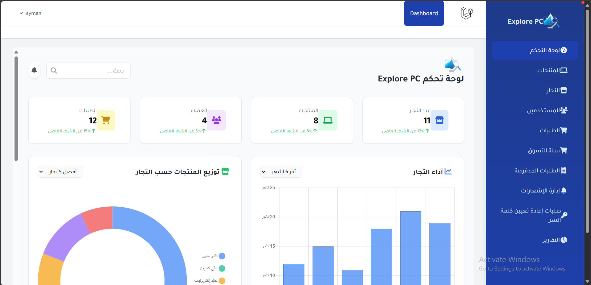
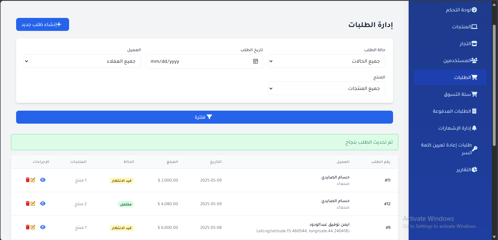
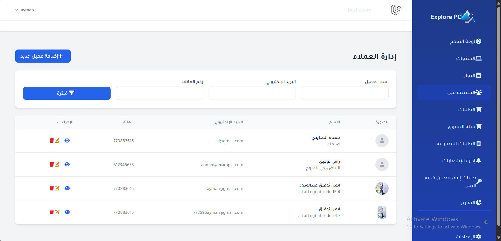
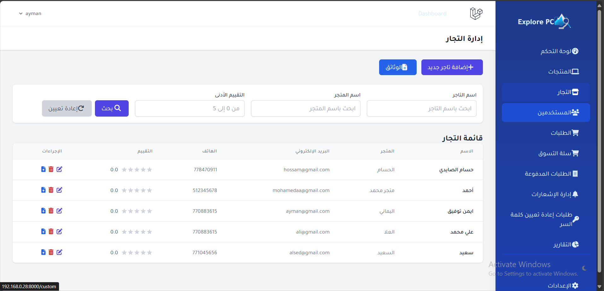
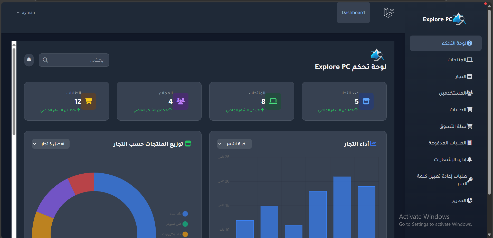

<p align="center">
  <a href="https://github.com/Eng-Ayman-Twfaq/ExplorePC_Dashboard.git" target="_blank">
    
  </a>
  
  <p align="center">
    <a href="https://github.com/770883616/ExplorePC-Dashboard/actions">
      
    </a>
    <a href="https://packagist.org/packages/explorepc/admin">
      
    </a>
    <a href="https://opensource.org/licenses/MIT">
      
    </a>
  </p>
</p>

## 🌟 نظام إدارة ExplorePC

لوحة تحكم متكاملة لإدارة منصتي:
- 🛍️ **تطبيق العملاء** (واجهة شراء المنتجات)
- 🏪 **تطبيق التاجر** (إدارة المخزون والطلبات)
- ☁️ **الخدمات السحابية** (Firebase, MySQL)

---

## 🚀 الميزات الرئيسية

<div align="center">

| الواجهة | الميزات | 
|---------|---------|
|  | **لوحة التحكم الرئيسية**<br>- إحصاءات المبيعات الحية<br>- رسوم بيانية تفاعلية<br>- نظرة عامة على الأداء |
|  | **إدارة الطلبات**<br>- تتبع حالات الطلبات<br>- فلترة متقدمة<br>- تحديث الحالة مباشرة |

</div>

---

## 📱 تطبيقات النظام

<div align="center">

| إدارة العملاء | إدارة التاجر |
|--------------|-------------|
|  |  |
| تصفح المنتجات<br>إتمام عمليات الشراء<br>تتبع الطلبات | إدارة المخزون<br>معالجة الطلبات<br>تحليل الإحصائيات |

</div>

---

## 💻 التقنية المستخدمة

dart
// تقنيات Flutter الأساسية
dependencies:
  flutter_bloc: ^8.1.3
  firebase_core: ^2.18.0
  cloud_firestore: ^4.9.0
  syncfusion_flutter_charts: ^23.1.40
php
// تقنيات Backend
"require": {
  "laravel/framework": "^10.0",
  "guzzlehttp/guzzle": "^7.0"
}
🛠️ التنصيب
bash
# الخطوات الأساسية
git clone https://github.com/Eng-Ayman-Twfaq/ExplorePC_Dashboard.git
cd ExplorePC-Dashboard
flutter pub get  # لتطبيق Flutter
composer install # للوحة التحكم Laravel
📞 الدعم والاتصال
<div align="center">
📧 ayman.tawfaq.developers@gmail.com
📱 +967 770 883 615

</div>
<div align="center"> <br> <sub>تم التطوير بواسطة <a href="https://github.com/770883616" style="color: #4CAF50;">AYMAN TAWFAQ</a> © 2025</sub> <br>  </div> ```